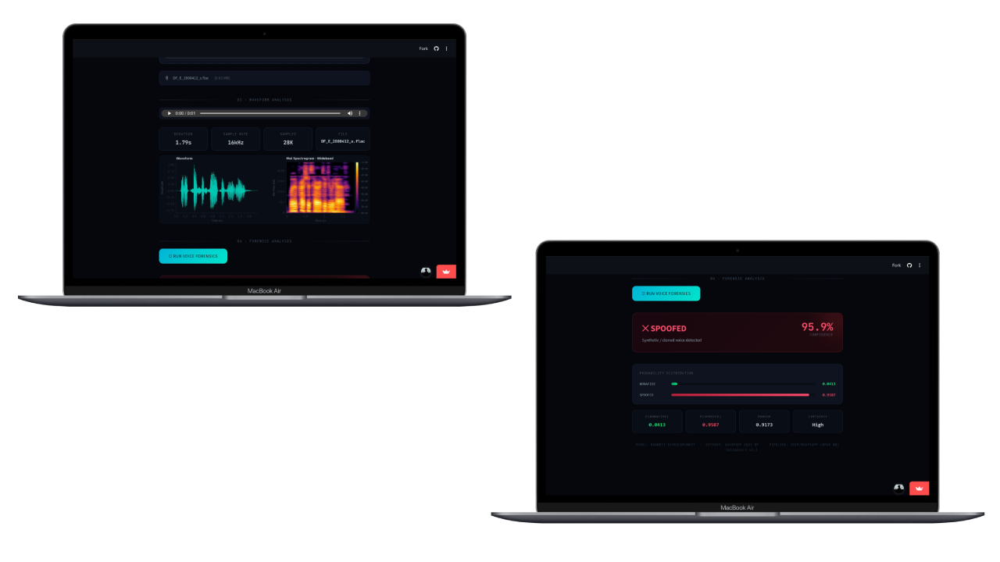

# 🎙️ Deepfake Voice Call Detection and Robustness Analysis Using RawNet3



## 🔎 About

An advanced deepfake audio forensics system utilizing the **RawNet3** architecture to detect synthetic voice manipulation. This project is rigorously benchmarked for robustness against realistic VoIP network degradations and deployed via an interactive Streamlit application.

**Live Demo:** [Streamlit App](https://rawnet3-aigeneratevoicedetection-49btyaj33ymc4q5ddw64hm.streamlit.app/)

**Project Language:** En & ID

---

## 📦 Dependencies

| Name       | Version |
| ---------- | ------- |
| torch      | 2.0.0+  |
| torchaudio | 2.0.0+  |
| streamlit  | 1.28.0+ |
| librosa    | 0.10.0+ |
| soundfile  | 0.12.0+ |
| scipy      | 1.10.0+ |
| numpy      | 1.24.0+ |
| matplotlib | 3.7.0+  |

---

## 🖥️ Requirements

### Operating System (OS)

- Windows 10/11
- macOS
- Linux

### Software Requirements

- Python >= 3.9
- PyTorch >= 2.0.0
- CUDA 11.8+ (optional, for GPU acceleration)

### Recommended Development Tools

- VS Code
- Google Chrome
- Microsoft Edge
- Mozilla Firefox
- Safari

---

## ⬇️ Installation

## 1. Create Project Directory

```bash
mkdir rawnet3_deepfake_detection
cd rawnet3_deepfake_detection
```

## 2. Create and Activate Virtual Environment

### Windows

```bash
python -m venv venv
venv\Scripts\activate
```

### Linux / macOS

```bash
python -m venv venv
source venv/bin/activate
```

## 3. Install Dependencies

Using requirements file:

```bash
pip install -r requirements.txt
```

Or install manually:

```bash
pip install torch torchaudio streamlit librosa soundfile scipy numpy matplotlib
```

## 4. Run Application

```bash
streamlit run streamlit_app.py
```

The application will automatically open in your browser:

```text
http://localhost:8501
```

---

## ✨ Features

### 🎧 Audio Upload & Forensic Analysis

Upload WAV or MP3 audio files and analyze whether the voice is genuine or AI-generated.

### 📡 VoIP Robustness Simulation

Evaluate model performance under realistic telecommunication network degradation scenarios.

### 📊 Interactive Dashboard

Visualize:

- Prediction results
- Confidence scores
- Audio waveform
- Processing information

---

## 📁 Project Structure

```text
rawnet3_deepfake_detection/
├── config.json                      # Model and processing configuration
├── inference.py                     # Production inference script
├── model_arch.py                    # RawNet3 architecture implementation
├── rawnet3_voip_full_checkpoint.pt  # Full checkpoint (weights + optimizer states)
├── rawnet3_voip_torchscript.pt      # TorchScript deployment model
├── rawnet3_voip_weights.pt          # Model weights only
├── README.md                        # Documentation
├── requirements.txt                 # Project dependencies
├── streamlit_app.py                 # Streamlit web application
├── banner_rawnet.png                # Repository banner
└── __pycache__/                     # Python cache files
```

---

## 🏗️ Audio Processing Pipeline

Before inference, the audio passes through a VoIP degradation simulation pipeline to emulate real-world voice call conditions:

1. **Resampling**
   - Audio converted to 16 kHz (wideband VoIP standard)

2. **Bandpass Filtering**
   - Frequency range limited to 50–7000 Hz

3. **Opus Codec Artifact Simulation**
   - Spectral smoothing on 20 ms frames to emulate lossy compression

4. **Packet Loss Simulation**
   - 2% random packet loss
   - Missing packets replaced with comfort noise

5. **Ambient Noise Injection**
   - 1/f pink noise
   - Signal-to-noise ratio (SNR): 25 dB

6. **Jitter Simulation**
   - Packet timing variation of ±5 ms

7. **Normalization**
   - Peak normalization to range [-1, 1]

---

## 🧠 Model Architecture

### Base Model

**RawNet3** with:

- SincConv
- Gated ConvNeXt Blocks
- Attentive Statistics Pooling

### Target Task

Binary classification for deepfake voice detection.

### Classes

| Label    | Description                     |
| -------- | ------------------------------- |
| Bonafide | Real human speech               |
| Spoofed  | Synthetic / AI-generated speech |

---

## 📊 Performance Metrics

Performance evaluated under simulated VoIP degradation conditions.

| Metric                                 | Value  |
| -------------------------------------- | ------ |
| Accuracy                               | 88.56% |
| Precision (Weighted)                   | 88.58% |
| Recall (Weighted)                      | 88.56% |
| F1-Score (Weighted)                    | 88.56% |
| AUC-ROC                                | 95.42% |
| Equal Error Rate (EER)                 | 11.29% |
| Matthews Correlation Coefficient (MCC) | 0.7714 |

---

## 🥼 Author

- **Wicaksono Hanif Supriyanto**
- **Muhammad Fattah**
- **Dwi Cahyani**

---

## 📚 References

1. Kim, J., Jung, J., Shim, H., & Yu, H. (2022). _RawNet3: Raw Waveform-based Speaker Verification Network with Advanced Architecture_. arXiv:2204.08486.

2. Yamagishi, J., Wang, X., Todisco, M., Sahidullah, M., Patino, J., Nautsch, A., Evans, N., et al. (2021). _ASVspoof 2021: Accelerating Progress in Automatic Speaker Verification Spoofing and Countermeasures_. Proceedings of ASVspoof 2021.

3. ASVspoof2021-DF Audio Dataset (Kaggle Subset) by Pratik Jodgudri. https://www.kaggle.com/datasets/pratikjodgudri/asvspoof2021-df-audio-dataset.

---

## ⚠️ Disclaimer

This project is intended for educational, research, and digital audio forensic purposes. Performance may vary under unseen real-world conditions, audio codecs, and network environments.
